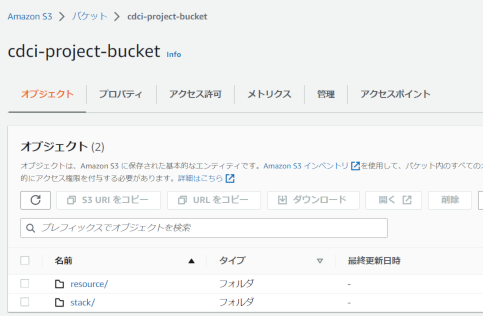
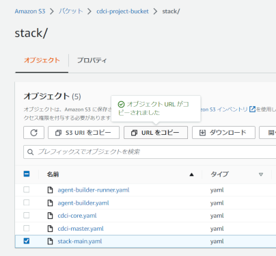
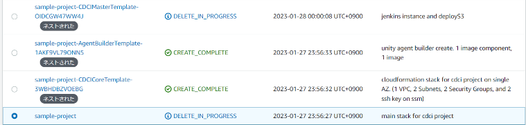

# CDCI Project
- [Introduction](#introduction)
- [Getting Started](#getting-started)
- [Security considerations](#security-considerations)
- [Release resources](#release-resouces)

## Introduction
このプロジェクトは、設定やパイプラインの実装などの複雑なプロセスを省いて、CDCI環境を簡単にAWSクラウド上に構築することができる環境セットです。

AWS CloudFormation上で実行され、Dockerでインスタンス構築、Jenkins Cascで環境設定、Job DSLでジョブ設定を行っているため、すべての環境がコードによって管理されています。

また、初期状態ではUnityのプロジェクトをクローンして、WebGLビルドをS3にデプロイするまでのジョブをプロジェクトに含めていますが、ソースを調整することでカスタマイズ可能です。

## Getting Started

### 1. プロジェクトをアップロード
このプロジェクトをクローンし、`cdci-project`フォルダ内にある、`resouce`フォルダと`stack`フォルダのファイル全て、AWSのS3バケット上にアップロードします。  
(アップロードするバケットには、このプロジェクト内のリソースからのフルアクセス権が与えられます。新規のS3バケットを使用することをお勧めします。)

バケットのルートに`resouce`フォルダと`stack`フォルダが存在することを確認してください。

仮に`cdci-project-bucket`と名付けました。

### 2. CloudFormation Stack Templateの作成
CloudFormation上で新しくスタックを作成します。

テンプレートのURLには、アップロードしたバケットの中の、`stack/stack-main.yaml`のURLを設定してください。

各パラメータは

- `EnvironmentName`
  - 環境名　各リソース名のプレフィックス名に使用します。
- `InitialPassword`
  - jenkinsのユーザー _`admin`_ のパスワードになります。
- `MasterInstanceType`
  - jenkinsのマスターインスタンスのEC2インスタンスタイプを指定します。
- `MyIP`
  - jenkinsにアクセス可能にするIPアドレスです。
- `S3BucketStack`
  - このプロジェクトをアップロードしたS3バケットを指定します。この例では`cdci-project-bucket`です。

<dl>
  <dd>これらの注意事項に注意してください。</dd>
  <dt>AWS CloudFormation によって IAM リソースがカスタム名で作成される場合があることを承認します。</dt>
  <dt>AWS CloudFormation によって、次の機能が要求される場合があることを承認します: CAPABILITY_AUTO_EXPAND</dt>
</dl>

### 3. シードジョブ実行
CloudFormationで実行したスタックのOutputsから、jenkinsのリンクを開いて _`admin`_ でログインしてください。  
(MyIPで指定したIPからのみページを閲覧することができます。)

ダッシュボードのルートにいくつか存在するジョブの一つを実行することでプロジェクトのCDCI環境をセットアップできます。

- `initialize_project`
- `initialize_project_submodule`
- `add_project`
- `add_project_submodule`

これらのジョブは初回実行時に各種セットアップが入るのでデフォルトのインスタンスタイプでは1時間程度かかります。  
下流ジョブの中にはinputで入力待ちをするステップを含むジョブがあるので、時折確認してセットアップを進めてください。

2回目以降で、同じUnityのバージョンを指定している場合はセットアップが発生しないため、10分程度で完了します。

シードジョブに使用されうるビルドパラメータ
- `GITHUB_PROJECT_REPOSITORY`
  - プロジェクトを管理するGitHubのリポジトリのSSHパスを指定します。`initialize_project, initialize_project_submodule`では**空のリポジトリを指定してください。(新規作成時にReadme.mdや.gitignoreを含めないようにしてください。)**
- `GITHUB_BUILDER_REPOSITORY`
  - プロジェクトビルド用のjenkinsfileを管理するリポジトリのSSHパスを指定します。**空のリポジトリを指定してください。(新規作成時にReadme.mdや.gitignoreを含めないようにしてください。)**
- `PROJECT_REPOSITORY_BRANCH`
  - `GITHUB_PROJECT_REPOSITORY`に加える、構成用ファイルや、SubModulesをコミットするブランチを指定します。
- `PROJECT_NAME`
  - プロジェクトの名前を指定します。ジョブのフォルダ名に使用されます。
- `UNITY_PROJECT_NAME`
  - Unityのプロジェクトの名前を指定します。ジョブ名やデプロイ時のフォルダ名に使用します。
- `UNITY_VERSION`
  - Unityのバージョンの前半部を指定します。例えばバージョン`2019.4.40f1`の場合、`2019.4.40`を入力します。
- `UNITY_HOTFIX_VERSION`
  - Unityのバージョンの後半部を指定します。例えばバージョン`2019.4.40f1`の場合、`1`を入力します。

実行中に発生するinputステップ
- `Wait for authorization (/github/certification_check)`
  - 指定リポジトリにコミットする権限のあるユーザーに、SSHキーを登録した後OKを選択してください。メッセージに登録用公開鍵が表示されます。
- `Wait input image version (/jenkins/setup_unity_agent)`
  - Unityエージェント用AMIの作成に用いる、Dockerイメージのバージョンを指定します。メッセージにDockerHub上のイメージリンクが表示されます。
- `Wait input ulf (/unity/get_ulf_license)`
  - Unityのライセンスを指定します。メッセージに手動アクティベーション用ライセンス作成リンクと、ALFライセンスのダウンロードリンクが表示されます。

完了後にprojectsフォルダ内にプロジェクトフォルダと、ビルドジョブが生成されます。

完成したビルドジョブを実行すると、デフォルトで追加されていたJenkinsfileを使用してscmビルドを開始します。(初期状態ではUnityプロジェクト内にシーンファイルが存在しないためエラーで終了します。)

## Security considerations

本リポジトリで作成した環境には、セキュリティ上にいくつかの問題が発生する可能性があります。
- adminのパスワードが、プロジェクトのビルド権限を持つユーザー、Jenkinsインスタンスに管理されたリポジトリにコミット可能なユーザーに知られる可能性があります。初回ログイン後にパスワードを変更することをお勧めします。
- インスタンスにいくつかのAWSのリソース実行ロールが付与されています。アクセスされる可能性のあるリソースを事前に確認してください。

## Release resources

環境の作成に使用したCloudFormationのルートスタックを削除してください。

ネストされたスタックは自動的に削除されるので、そのままで問題ありません。

**スタックの削除が完了しても、このプロジェクトで作成されたいくつかのリソースは残り続けています。**

- [S3::Bucket]`環境名`-agent-builder-log
  - UnityイメージのAMIビルドをした際に発生したログが格納されています。削除する場合は、中身を空にして削除してください。
- [S3::Bucket]`環境名`-cdci-master-deploy-bucket	
  - jenkinsのジョブで作成されたUnityプロジェクトのWebGLビルド成果物です。削除する場合は、中身を空にして削除してください。
- [EC2::AMI]`環境名`-`Unityバージョン`-webgl
  - jenkinsのUnityWebGLビルドエージェント用AMIです。削除する場合、関連するスナップショットも忘れず削除してください。